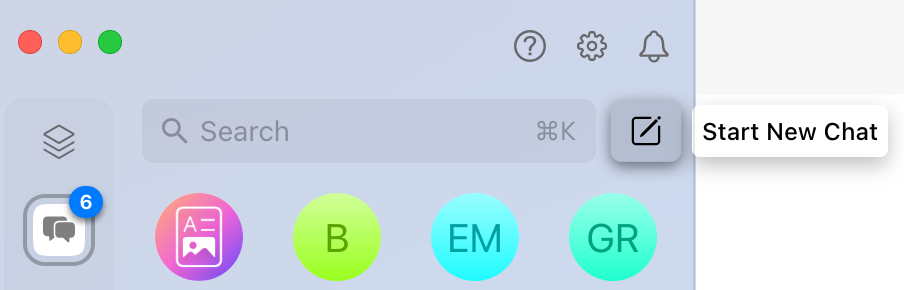
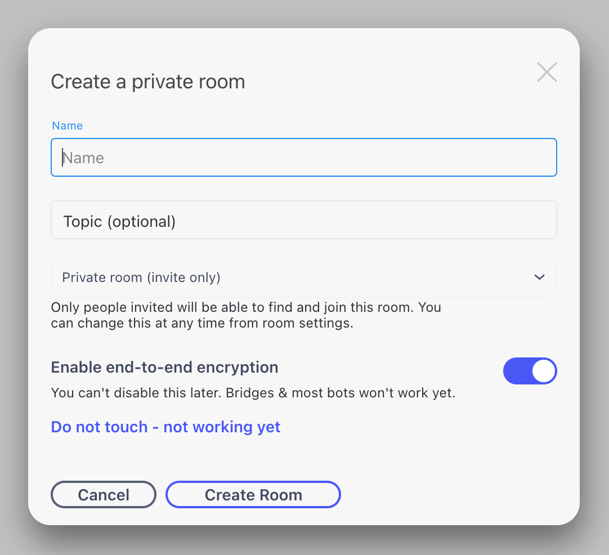
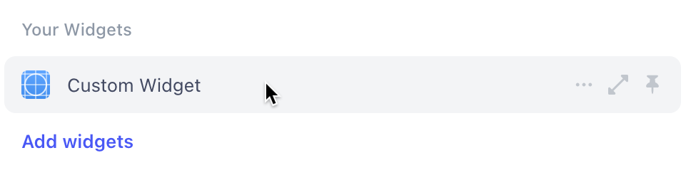

# Beeper SDKs
This repo will contain instructions for various SDKs that can be used with Beeper.

# Widgets

Widgets are webpages that live on the sidebar of Beeper. They can access data from a chat in Beeper, such as messages and a list of users. They can also take actions, such as sending messages on the user's behalf.

[//]: # (TODO: make this better. widgets are unique and mostly unprecedented in major chat networks; now people can have them in any)

## Get started in 5 minutes

We'll set you up with a [NextJS](https://nextjs.org/) project that will provide a foundational codebase you can then build upon.

[//]: # (TODO: add a part about toggling the feature in labs. make sure that it's also in the section on installing widgets, or maybe i just put it once overall?)

#### Install Node

If you haven't already, install the latest LTS or Current version of Node.js. It is recommended to also install `yarn` as well:

```bash
npm install --global yarn
```

#### Clone the repo

Type the following in your terminal:

```bash
npx create-next-app --example https://github.com/beeper/widget-example --use-yarn --app
```

This will prompt you "Ok to proceed? (y)". Type in y.

It will then ask for your project name. This will be the name of the project's folder on your computer.

Wait for packages to install. Then, type in your terminal, `cd` (the name of your project), and after that, `yarn dev`.

#### Install the widget

[//]: # (TODO: ADD LABS INSTRUCTIONS + RECENT CHAT CACHING DISABLE)

In Beeper, press the "Start New Chat" button:



Then press "Create group chat", then "Beeper (Matrix)".

You'll see a pop-up that looks like this:



In "Name", type something like "test room". This will be a room where you can test out your widgets during development.

Next, click the "i" icon on the top-right to open the sidebar. In the sidebar, click the blue "Add widget" text. You'll see a pop-up with a field to enter a URL. Enter `http://localhost:3000`, then press enter. Click the `x` button on the top-right of the popup.

You'll see a new widget in your sidebar. Click on it (anywhere on the background rectangle, not the buttons on the right) to open it in your sidebar.



Wait a couple of seconds for NextJS to compile the page and for it to load. You'll then see the example widget! Click through it to explore some of the functionality, and open it up in your code editor to make changes.

## Build a widget

### Develop

The example project you just cloned contains the foundations for widget-making. You can build your widget directly by modifying the codebase there. 

The codebase is built using [NextJS](https://nextjs.org/). If you haven't already used NextJS, don't worry - NextJS is just a layer on top of React that makes the developer experience better. It handles things like routing, hot-reloading, server-side rendering, performance optimizations, and various other things. 

If it is your first time on NextJS, you may want to check out the [NextJS Docs](https://nextjs.org/docs), specifically [Routing](https://nextjs.org/docs/app/building-your-application/routing). The codebase has inbuilt support for [Tailwind CSS](https://tailwindcss.com/) and [CSS Modules](https://nextjs.org/docs/app/building-your-application/styling/css-modules). You can also use Sass via [these instructions](https://nextjs.org/docs/app/building-your-application/styling/sass).

The page immediately rendered when you open your widget is `app/page.tsx`. You can either write your React app all within that page, or make and import components. 

Before being able to access data from the chat room, you'll need to request permissions via the widget. You can do this via the array of `capabilities` passed to `MuiCapabilitiesGuard` in `app/page.tsx`.

That's it! A widget really is just an embedded webpage that can interact with data from the chat room, so just like with regular websites, you have complete freedom on what you want to build. 

[//]: # (Maybe add something about "use client" being needed in NextJS. Or a Troubleshooting section. Assuming I haven't already fixed the "use client" thing)

### Ship

Once you've made a widget, you can easily get it up and running on [Vercel](https://vercel.com/), the creator of NextJS, so you'll have a URL you can share with others so that they can install it to their Beeper accounts. 

Just push your code to a GitHub repo, then create an account on [vercel.com](https://vercel.com/). You'll see a screen that lets you import a Git repository. Select the one you just created, and Vercel will build and deploy your widget! It'll generate a URL that others can access it on (and you can change it to a different URL or put it on a custom domain), and every time you push to GitHub, the newest version of your widget will automatically be shown to all users.

## Examples

The example repo you just cloned: https://github.com/beeper/widget-example

Summarizer: a  widget that finds the last message you read and then fetches and summarizes your unread messages. https://github.com/beeper/widget-summarizer

"Do It": a widget that's like a universal smart button. You press it and it guesses what you need based on the conversation. https://github.com/beeper/widget-do-it

## API Documentation

### Background Info on Matrix

Matrix, the chat protocol, consists of "events". Events represent data inside a chat, which Matrix calls a "room". Events are split into two types: room events and state events.

In Beeper, the list of chat messages is called a "timeline". Room events represent events inside of that timeline, that happen one after another. For example, messages being sent, messages being deleted, or reactions being applied. State events represent the current state of a room, for example, the title and the list of participants. State events have a singular current value.

Room account data is JSON data stored inside of each Beeper account, inaccessible by other users. Inside of room account data, Beeper stores the indicator of which message has been last read, and whether the chat has been marked "done", and whether it has been marked "unread".

### Widget API Info

The code from the example widget will have already set up the fundamentals, so most of the API-related code you'll write will be based on `useWidgetApi` from `@beeper/matrix-widget-toolkit-react`.

You'll create an instance of a `WidgetApi` by calling `useWidgetApi()`, and can then call various methods on it.

Methods called on a WidgetApi instance return promises, so they should be called using either async/await or .then().


In code, it looks like this:
```javascript
import { useWidgetApi } from "@beeper/matrix-widget-toolkit-react";

// Use inside of a React component
const widgetApi = useWidgetApi();
```


For example:

```javascript
import { useWidgetApi } from "@beeper/matrix-widget-toolkit-react";
import { useEffect, useState } from "react";
import { RoomEvent } from "@beeper/matrix-widget-toolkit-api";

export default function Home() {

    const [message, setMessage] = useState("")
    const widgetApi = useWidgetApi()
    
    async function fetchData(event: any) {
        event.preventDefault();
        setMessage("");

        await widgetApi.sendRoomEvent('m.room.message', {
            msgtype: 'm.text',
            body: message,
        });
    }
    
    return (
        <form onSubmit={fetchData}>
            <input value={message} onChange={(event) => setMessage(event.target.value)} />
        </form>
    );
}
```

#### Types Info (for TypeScript)

`RoomEvent`: `import { RoomEvent } from "@beeper/matrix-widget-toolkit-api";`

```javascript
RoomEvent<T>:

{
    type: string;
    sender: string;
    event_id: string;
    room_id: string;
    origin_server_ts: number;
    content: <T>;
}
```

`StateEvent`: `import { StateEvent } from "@beeper/matrix-widget-toolkit-api"`

```javascript
StateEvent<T>:

{
    type: string;
    sender: string;
    event_id: string;
    room_id: string;
    origin_server_ts: number;
    state_key: string;
    content: T;
}
```

`RoomAccountData`: `import { RoomAccountData } from "@beeper/matrix-widget-toolkit-api";`

```javascript
RoomAccountData<T>:

{
    type: string;
    room_id: string;
    content: T;
}
```

### Room Events

#### Receiving

```javascript
const events: RoomEvent<any>[] = await widgetApi.receiveRoomEvents(eventType, {
    messageType?: string;
    limit?: number;
    roomIds?: string[] | Symbols.AnyRoom;
    since?: string | undefined;
});
```

eventType (string): the "m.type" key in the JSON representing the event you want to get. Each room event inside of a Matrix client has its own "m.type" key. Examples:

- messages: "m.room.message"
- reaction: "m.reaction"
- roomIds: array of ids of other rooms to get events in. Symbols.AnyRoom is "*"

Request permissions for the "eventType", like so:
```javascript
WidgetEventCapability.forRoomEvent(
    EventDirection.Receive,
    'm.room.message' // replace with the eventType you requested
),
```

Response format:
```json
[
    {
        "content": {
            ...
        },
        "origin_server_ts": 1689883910958,
        "room_id": "!jqIPEzQnHoxVKgBgVM:beeper.com",
        "sender": "@griffin:beeper.com",
        "type": "m.reaction",
        "unsigned": {
            "age": 1228375,
            "transaction_id": "m1689883910662.65",
            "com.beeper.hs.order": 720911906
        },
        "event_id": "$jbXMaSmOJvgJa7oFaMjlr8RxHIc39hnfnDxqnCiaTd4",
        "user_id": "@griffin:beeper.com",
        "age": 1228375
    }
]
```

`content` varies depending on the `eventType`. Examples:

m.room.message:
```json
"content": {
    "msgtype": "m.text",
    "body": "hello there",
    "com.beeper.linkpreviews": [],
    "com.beeper.origin_client_type": "desktop",
    "_isEmojiBody": null,
    "com.beeper.origin_client_ts": 1689883904990,
    "com.beeper.origin_client_version": "3.66.1"
},
```

m.reaction:
```json
"content": {
    "com.beeper.origin_client_ts": 1689883910662,
    "com.beeper.origin_client_type": "desktop",
    "com.beeper.origin_client_version": "3.66.1",
    "com.beeper.reaction.shortcode": ":heart:",
    "m.relates_to": {
        "event_id": "$ul_WqBU0XMWTyS773XAZtX2KPRjRVyt6ba4xhxDmf7A",
        "key": "❤️",
        "rel_type": "m.annotation"
    }
},
```

`since` (string) is an optional parameter to fetch only messages after a certain message. Pass in the message's eventId as a string. For example, to get only unread messages, get `m.fully_read` from room account data, then set that as the `since` parameter.

#### Sending

```javascript
const events: RoomEvent<any>[] = await widgetApi.receiveRoomEvents(eventType, {
    messageType?: string;
    limit?: number;
    roomIds?: string[] | Symbols.AnyRoom;
    since?: string | undefined;
});

await widgetApi.sendRoomEvent(eventType: string, content: {
  ...  
});
```

`content` varies depending on the eventType. For example:

```javascript
await widgetApi.sendRoomEvent('m.room.message', {
    msgtype: 'm.text',
    body: "Hello everyone!",
});
```

```javascript
await widgetApi.sendRoomEvent('m.room.redaction', {
    redacts: "$ul_WqBU0XMWTyS773XAZtX2KPRjRVyt6ba4xhxDmf7A" // this is the eventId
});
```

To send an event in another room, specify the roomId in `roomIds[]`. Not needed if you want to send an event in the currently-viewed room.

[//]: # (TODO: elaborate)
content: content specific to your command. For example, if `eventType` = `"m.room.redaction"`:
```javascript
{
    redacts: eventId // eventId is string
}
```

As usual, you'll need to request permissions:
```javascript
WidgetEventCapability.forRoomEvent(
    EventDirection.Send,
    'm.room.redaction' // replace with the eventType you're using
)
```
### State Events

#### Receiving

```javascript
const events: StateEvent<any>[] = await widgetApi.receiveStateEvents(eventType, {
    stateKey, // Optional: string
    roomIds, // Optional: string[] | Symbols.AnyRoom
});
```

eventType (string): the "m.type" key of the JSON representing the state event you want. Each state event inside of a Matrix client has its own "m.type". Examples:

- room members: "m.room.member"
- room name: "m.room.name"

stateKey: to get the value of something (for example, the room name) at a certain point in time, provide the stateKey (as a string) corresponding to the state event. For example, if someone changed the room name but you'd like the previous one, provide the previous state key.

roomIds: an array of other rooms to get state events from. Don't need to specify roomIds if you're just looking for the current room. Symbols.AnyRoom (to get the state event from all of the user's rooms) is "*".

#### Sending

This is most useful if you're in a Matrix chat (eg. if you're in a Beeper-Beeper chat room). If you're using Beeper to chat on another network, your changes might not show there (for example, changing a room name in a WhatsApp chat using a Widget doesn't change it in WhatsApp, but rather only inside your Beeper client). 

```javascript
await widgetApi.sendStateEvent(eventType, content, {
    stateKey, // Optional: string
    roomId, // Optional: string
});
```

### Room Account Data

The primary use for room account data when developing widgets is probably getting the `m.fully_read` indicator. This is a string representing the most recent message that the user has seen. 

Room account data can currently only be read from; you can't write to it.

```javascript
const data = await widgetApi.receiveRoomAccountData(eventType, {
    roomIds // Optional: string[] | Symbols.AnyRoom;
});
```

For example, to get only unread messages:

```javascript
const fullyReadData: RoomAccountData<any>[] = await widgetApi.receiveRoomAccountData('m.fully_read');
const fullyRead: string | undefined = fullyReadData[0].content.event_id;
roomEvents = await widgetApi.receiveRoomEvents('m.room.message', {limit: limit, since: fullyRead});
```

Permissions:

```javascript
WidgetEventCapability.forRoomAccountData(
    EventDirection.Receive,
    'm.fully_read' // Replace with the eventType you're using
)
```

## Credits

Thanks to [Nordeck](https://github.com/nordeck) for their wonderful library [matrix-widget-toolkit](https://github.com/nordeck/matrix-widget-toolkit). Beeper widgets are built on their library, plus some additional modifications for extra functionality.